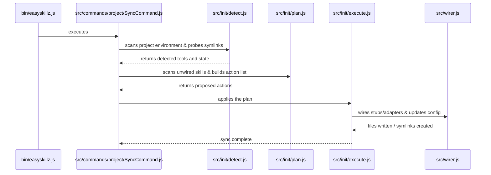

# Understanding the Codebase

This guide explains the architecture of `easyskillz` and how its components interact. It is designed to help maintainers and developers navigate the codebase and modify its behavior.

---

## 🏛️ System Architecture

`easyskillz` is built around a unidirectional synchronization pipeline. 

### Synchronization Lifecycle
When a user runs `easyskillz project sync`, the command executes the following phases sequentially:



---

## 📁 Codebase Directory Structure

```text
bin/
  easyskillz.js       # CLI entry point; handles domain and argument parsing.
src/
  commands/           # Command handlers grouped by domain:
    project/          #   - SyncCommand, DoctorCommand
    skill/            #   - AddCommand, RemoveCommand, ActivateCommand, ListCommand
    tool/             #   - RegisterCommand, UnregisterCommand, ListCommand
    docs/             #   - SyncCommand, ListCommand
  core/
    BaseCommand.js    # Base class for all CLI commands. Sets up standard JSON/interactive outputs.
  detectors/          # Directory check routines. One file per tool (e.g. claude.js, cursor.js).
  docs/               # Module for centralizing custom instructions/docs (syncFolder.js, centralizeFiles.js).
  gitignore/          # Helper modules to manage and update `.gitignore` files.
  init/               # Core synchronization scripts (detect.js, plan.js, execute.js).
  registry.js         # The directory of all supported tools and their standard wiring paths.
  wirer.js            # The wiring engine. Evaluates states, creates symlinks, and generates adapters.
tests/                # Test suites using Node's native test runner (unit, detectors, E2E).
```

---

## 🔗 The Wiring Engine (`src/wirer.js`)

The core utility responsible for linking central skill files into tool-specific folders is `wirer.js`. It utilizes three distinct wiring strategies depending on what each AI tool supports:

### 1. Symlink Strategy
*   **Target Tools**: Claude Code (`.claude/skills/`).
*   **Mechanism**: Creates directory symlinks from `.easyskillz/skills/<skill-name>` directly to the tool's target folder. Extremely fast and keeps files synchronized live.

### 2. Flat File / Stub Strategy
*   **Target Tools**: Cursor (`.cursorrules` or `.cursor/rules/*.mdc`), Windsurf (`.windsurf/workflows/`).
*   **Mechanism**: Writes a single text file (or workflow file) at the destination. For tools that do not support directory structures, we write a flat stub referencing the main instructions.

### 3. Directory Adapter Strategy
*   **Target Tools**: Devin (`.devin/skills/`), Codex (`.agents/skills/`), Gemini/Antigravity (`.gemini/skills/`).
*   **Mechanism**: Instead of creating directory symlinks (which can cause issues with Git or environment sync), this strategy creates a **real physical directory** at the destination containing a lightweight `SKILL.md` file (an adapter) pointing back to the central skill file:
    ```markdown
    ---
    name: skill-name
    description: brief-description
    ---
    <!-- easyskillz-generated -->
    Read the full skill instructions from: `.easyskillz/skills/skill-name/SKILL.md`
    ```
